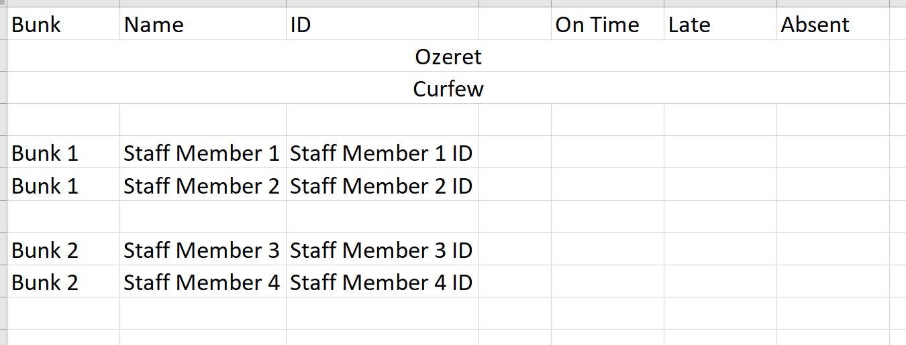
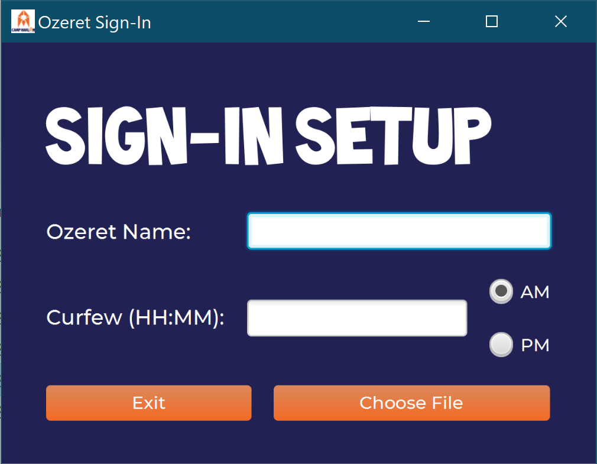
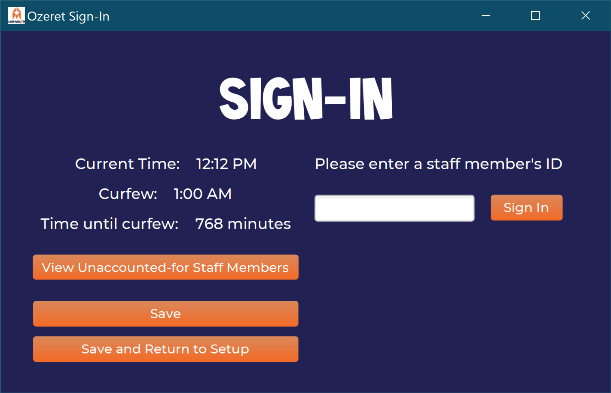
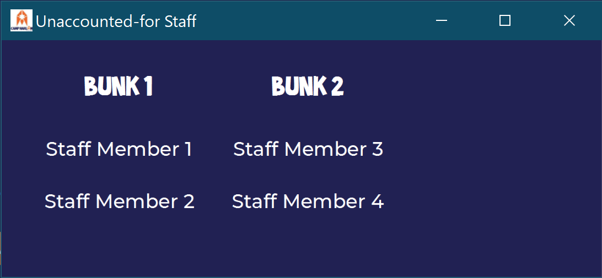
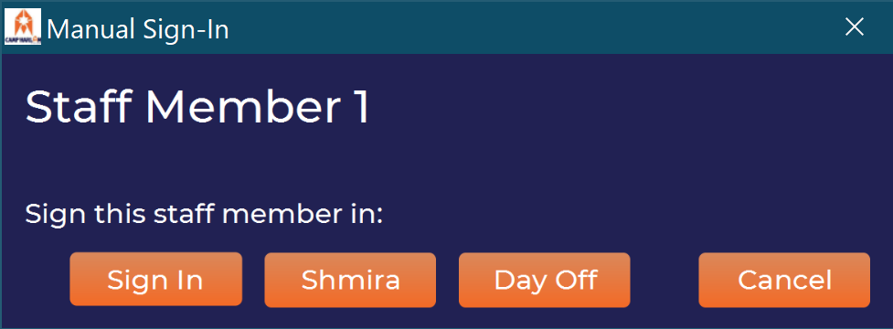

# Ozeret Sign In <!-- omit in TOC -->

*written by Cooper Schwartz*

## **Table of Contents** <!-- omit in TOC -->
- [License](#license)
- [How to Run this Program](#how-to-run-this-program)
  - [*Executable Version*](#executable-version)
- [Instructions](#instructions)
  - [*Spreadsheet Format*](#spreadsheet-format)
  - [*Application Use*](#application-use)
- [Known Bugs](#known-bugs)
  - [*Blank Staff Member (potentially removed)*](#blank-staff-member-potentially-removed)
- [Changelog](#changelog)
  - [*Version 1.3 (released 3/12/2021)*](#version-13-released-3122021)
  - [*Version 1.2 (released 2/11/2021)*](#version-12-released-2112021)
  - [*Version 1.1 (released 8/7/2020)*](#version-11-released-872020)

## License

Copyright 2020 Cooper Schwartz

Licensed under the Apache License, Version 2.0 (the "License");
you may not use this file except in compliance with the License.
You may obtain a copy of the License at

    http://www.apache.org/licenses/LICENSE-2.0

Unless required by applicable law or agreed to in writing, software
distributed under the License is distributed on an "AS IS" BASIS,
WITHOUT WARRANTIES OR CONDITIONS OF ANY KIND, either express or implied.
See the License for the specific language governing permissions and
limitations under the License.

---

## How to Run this Program

The file `src/ozeret/OzeretMain.java` contains the main method for this program.

### *Executable Version*

The zip file in this repository called `OzeretSignIn.zip` is a standalone version of this project (I believe it does still require a JRE. but not a full JDK). The functionality of `OzeretSignIn.exe` (in the zip file) is identical to the code in the `src/ozeret` folder. If you don't have an operating system that can run an `*.exe` file, you should be able to use the file `harlam-ozeret.jar` the the folder `ozeret jar and xml` in place of `OzeretSignIn.exe`.

---

## Instructions

### *Spreadsheet Format*

I have provided a sample spreadsheet as a means to show you a possible way to have your input spreadsheet formatted. You can find it [here](resources/files/Sample_Attendance_File.xlsx). I recommend that you leave my sample as-is and either copy it or make your own for use.  

The way that my sample is formatted is not the only way that the spreadsheet can be formatted, so feel free to set yours up in a way that makes sense to you and follows the rules outlined below.

  

The `Bunk` and `Name` columns *must* be present in the spreadsheet; they are in fact the only two required columns.   
The `ID` column holds the ID that staff members sign in with is something other than their name (e.g. a number). If staff members sign in with their name, the `ID` column does not need to exist. 
The `On Time`, `Late`, and `Absent` columns can exist if you want to gather the respective summary statistics about how many times each staff member was on time, late, or absent, respectively. You don't have to have all three if you don't want to—just pick the ones you want.  

These columns can be in whatever order you want them to be, and you can feel free to add empty columns between them to space them out (as the sample does between `ID` and `On Time`).

The second and third rows should not be empty. The program will write the name of the person on Ozeret in the second row and the time of curfew in the third, so it probably makes sense to write something in those rows to say that. The sample has `Ozeret` and `Curfew`, but the exact text doesn't matter. It also doesn't matter whether the cells are merged across the columns (as the sample has it) or not. I did so in the sample because I thought it looked nicer.

Each row represents a staff member. The staff member's name should be in the `Name` column, their bunk in the `Bunk` column, and their ID in the `ID` column (if it exists). The `On Time`, `Late`, and `Absent` columns (if they exist) can either be empty or have a number in them (an empty cell is treated as if it has a 0 in it).  

Once you're satisfied with your spreadsheet's layout, save it (it doesn't matter where, but I recommend saving it in this folder for ease of access) and start the application.

### *Application Use*

The first screen that shows up on application start-up is relatively self-explanatory. Type in your name and what time curfew is, then select `Choose File` to select the attendance spreadsheet.

This is the main window of the application. In order to sign in a staff member, type/scan/enter their name (or ID, if it exists) into the text field and click the `Sign In` button or press Enter. Confirmation and error messages will be displayed on the area below the text field and the `Sign In` button.  
If you want to write all currently taken data back to the attendance spreadsheet, press the `Save` button, and if you're done signing in, press the `Save and Return to Setup` button to write back to the attendance spreadsheet and return to the previous (setup) screen.  

**VERY IMPORTANT: Make sure you do not have your attendance spreadsheet open while attempting to write to it (`Save` or `Save and Return to Setup`). The write will fail and data may be lost.**

Clicking on `View Unaccounted-for Staff Members` will bring up a list of all staff members listed in the attendance file that have not yet signed in in this session, listed by bunk. Clicking on the name of a staff member in this list will bring up additional options for them.

Clicking on the `Sign In`, `Shmira`, or `Day Off` buttons in this window will sign in the listed staff member either normally, as on shmira, or as on a day off, respectively.

---

## Known Bugs

### *Blank Staff Member (potentially removed)*

If the first "staff" row in an input spreadsheet (e.g. row 4 in the sample) is a blank row, sometimes a blank space will appear first when clicking on the `View Unaccounted-for Staff Members` button. This is treated as if the spreadsheet listed a staff member with no name and no bunk, and allows the user to sign this staff member in as normal.  

I have no idea how to reliably reproduce this bug, but I suspect it's due to my misunderstanding of the Apache POI library causing a formatting issue in the Excel spreadsheet. If you can find a way to reliably reproduce this bug, I would love to know how.

I haven't noticed this bug occurring since before version 1.1 released, so it's possible I may have fixed it without even noticing.

---

## Changelog

### *Version 1.3 (released 3/12/2021)*

- An info button was added to the bottom right of both the initial screen and main window. Clicking on this button will provide a basic set of instructions for what to do on the current screen, as well as show the credits for this software.

### *Version 1.2 (released 2/11/2021)*

- A bug that caused a staff member to be incorrectly marked as late when curfew time hadn't yet passed was fixed.
  - This bug occured due to curfew being assumed to be on the same day as when the staff member signed in, when in reality this is not always true (e.g. if curfew is at 1:00 AM and a staff member signs in at 11:30 PM, curfew is technically the next day, and the staff member is on time).

### *Version 1.1 (released 8/7/2020)*

- A bug that caused the text reading `Current Time`, `Curfew`, and `Time until curfew` to overlap previous versions of themselves was fixed.
- In addition to the time a staff member signs in being written to the attendance `*.xlsx` file, the cell is now colored according to when the staff member signed in. This is to make seeing overall trends more easily visible at a glance.
  - A green background means that the staff member signed in on time (or was on shmira or a day off), a yellow background means that the staff members signed in after curfew, and a red background means that the staff member did not sign in at all.